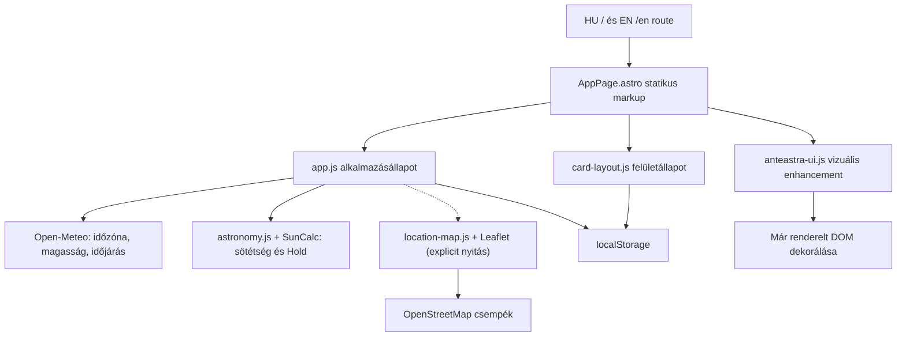

# AnteAstra fejlesztői kézikönyv

Ez a dokumentum a repó kézi fejlesztéséhez szükséges technikai térkép. A célja, hogy egy új fejlesztő ne csak azt lássa, melyik fájlt kell módosítani, hanem azt is, mely kapcsolatok és invariánsok tarthatják helyesen az alkalmazást.

## 1. Melyik dokumentum mire való?

- `README.md`: rövid projektbemutató, első indítás és deploy-belépő.
- `DEVELOPMENT.md`: architektúra, adatfolyamok, bővítési receptek és ellenőrzési lista.
- `PROJECT_CONTEXT.md`: termékcélok és a már meghozott UX/termékdöntések indoklása.
- `AGENTS.md`: kötelező munkaszabályok kódoló agenteknek; emberi fejlesztésnél is jó ellenőrzőlista.
- `CHANGELOG.md`: felhasználói szempontból fontos változások, nem technikai napló.

Eltérés esetén előbb a futó kódot és a Git-előzményt ellenőrizd, majd ugyanabban a változtatásban igazítsd hozzá a dokumentációt. Verzióállapothoz a `package.json`, a `package-lock.json`, a `public/VERSION.txt`, a `CHANGELOG.md`, valamint a Git tag együtt tekintendő teljes képnek.

## 2. Gyors indulás

Követelmények:

- Node.js `22.12.0` vagy kompatibilis újabb támogatott páros verzió (`.node-version`);
- npm `10.9.2` vagy a lockfile-t helyesen kezelő kompatibilis npm;
- nincs szükség `.env` fájlra, saját backendre vagy helyi adatbázisra.

Friss klón reprodukálható telepítése:

```bash
npm ci
npm run dev
```

Meglévő munkakönyvtárban, ha a repó munkaszabályai kifejezetten a telepítés ellenőrzését kérik:

```bash
npm install
npm run build
```

A fejlesztői szerver címe megjelenik a terminálban. A két lokalizált útvonal:

- magyar: `http://localhost:4321/`;
- angol: `http://localhost:4321/en`.

Éles build és helyi előnézet:

```bash
npm run build
npm run preview
```

A publikálható statikus oldal a nem verziókezelt `dist/` könyvtárba kerül.

Módosítás előtt mindig:

```bash
git status -sb
git fetch origin
```

Ne kezdj feature-munkát közvetlenül a `main` ágon. Ne írj felül ismeretlen lokális változtatást, és dependency-frissítést csak külön, tudatos karbantartási scope-ban végezz.

## 3. Repótérkép

| Hely | Felelősség |
|---|---|
| `src/pages/index.astro` | Vékony HU route, a közös oldalnak `lang="hu"` értéket ad. |
| `src/pages/en/index.astro` | Vékony EN route, a közös oldalnak `lang="en"` értéket ad. |
| `src/components/AppPage.astro` | Közös statikus, szemantikus oldalváz, SEO, dialog és minden fő kártya. |
| `src/i18n/translations.js` | A HU és EN felületi, státusz- és formázási szövegek egyetlen forrása. |
| `src/scripts/app.js` | Helyszín, Open-Meteo-adatok, alkalmazásállapot és renderelés. |
| `src/scripts/astronomy.js` | DOM-független nap-/holdszámítás a rögzített SunCalc verzióval. |
| `src/scripts/card-layout.js` | Kártyasorrend, láthatóság, összecsukás, dialog draft és localStorage. |
| `src/scripts/location-map.js` | Csak megnyitáskor betöltött Leaflet-adapter, térképdraft és OSM-csempék. |
| `src/styles/global.css` | Astro által feldolgozott, fingerprintelt alaptéma és domainstílusok. |
| `src/styles/location-map.css` | A Leaflet-adapterrel együtt, késleltetve injektált térkép- és vörösmód-stílusok. |
| `public/card-layout.css` | Bundle-olatlan kártya-/dialogstílusok. |
| `public/anteastra-ui.js` | Progresszív vizuális kiegészítés: mobil settings-gomb és időjárás-dekoráció. |
| `public/anteastra-ui.css` | A progresszív UI-réteg és a nyelvváltó stílusai. |
| `public/` további fájljai | Változtatás nélkül a `dist/` gyökerébe másolt SEO-, PWA-, szerver- és verziófájlok. |
| `astro.config.mjs` | Statikus output, kanonikus site URL és HU/EN routing. |
| `.github/workflows/build.yml` | PR-, `main`- és kézi buildellenőrzés, artifact készítése. |
| `.github/workflows/deploy.yml` | Kizárólag kézzel indítható build és szigorú FTPS production deploy. |

## 4. Architektúra röviden



Az oldal statikus-first: az érdemi struktúrát az Astro komponens rendereli. A kliensoldali JavaScript értékeket frissít és viselkedést ad hozzá, de nem építi újra a fő kártyaszerkezetet.

A lap alján két kliensréteg indul:

1. az Astro által bundle-olt modul meghívja az `initApp()` és `initCardLayout()` függvényt;
2. a nyers `public/anteastra-ui.js` progresszív vizuális kiegészítést végez.

Az `anteastra-ui.js` nem adatforrás. Az alaprendszernek akkor is értelmesnek kell maradnia, ha ez a dekorációs réteg nem fut le.

## 5. DOM-szerződések

Az `AppPage.astro` számos `id`, `data-*`, osztály- és ARIA-kapcsolatot ad a kliensmoduloknak. Ezek belső API-k, nem tetszőlegesen átnevezhető stílushorgok.

Különösen fontos:

- az `app.js` a DOM-azonosítókat a `mapUi()` listájából térképezi fel;
- a `data-card-key` értékeknek egyezniük kell a layout-regiszterrel;
- a `data-state` értékeket CSS és a vizuális enhancement is olvassa;
- az `aria-controls` célpontoknak és a kártyatest-azonosítóknak párban kell maradniuk;
- az időjárási órakártyák sorainak sorrendjét jelenleg a publikus enhancement is feltételezi.

Átnevezés előtt mindig futtass repószintű keresést, például:

```bash
rg "weather-status-badge|data-card-key|layout-settings-dialog"
```

## 6. Kiválasztott helyszín és adatfolyam

A legfontosabb alkalmazásinvariáns:

> Minden kijelzett helyszínfüggő érték vagy az aktuálisan kiválasztott észlelőhelyhez tartozik, vagy üres/hibaállapotot mutat.

A `setLocation()` egy koherens helyszínváltási tranzakció:

1. növeli a monoton `locationRequestId` azonosítót;
2. megszakítja az előző Open-Meteo-kérést;
3. azonnal kijelöli az új helyet;
4. még a hálózati várakozás előtt törli az előző időzóna-, időjárás- és égadatokat;
5. egy Open-Meteo-válaszból normalizálja az időzónát, a magasságot és az időjárást;
6. külön hibahatáron, helyben kiszámítja a sötétség- és holdadatokat;
7. csak akkor ír state-et és UI-t, ha a válasz az aktuális kéréshez tartozik;
8. csak sikeres helyszínlekérés után menti az új helyet;
9. hibánál nem mutatja az eszköz saját időzónáját a kiválasztott hely zónájaként.

Az `AbortController` erőforrást takarít meg, a kérésazonosító pedig akkor is kizárja a régi választ, ha a megszakítást egy köztes réteg figyelmen kívül hagyja. Új helyszínfüggő adatot ugyanehhez az invalidálási és stale-response védelemhez kell csatlakoztatni.

A „frissítés” gomb a neve ellenére a teljes helyszíntranzakciót újrafuttatja. Ez szándékos: az időzóna, a magasság, az időjárás és a csillagászati snapshot így nem válik szét egymástól.

### Térképes helyszíndraft

A térkép nem önálló alkalmazásállapot és nem ír közvetlenül `localStorage`-ot. A folyamat:

1. a felhasználó explicit megnyitja a map dialogot;
2. az `app.js` dinamikusan importálja a `location-map.js` modult;
3. a térkép az aktuális helyre, ennek hiányában lokalizált alapnézetre áll;
4. kattintás, koppintás, húzás vagy billentyűzetes pásztázás csak a dialog koordinátadraftját módosítja;
5. a **Kijelölt hely használata** sima `{ latitude, longitude }` értékeket ad az `applyCoordinateLocation()` wrappernek;
6. a wrapper a közös `setLocation()` tranzakciót hívja `source: "Map"` értékkel;
7. Mégse, X, Escape és backdrop nem változtatja meg a kiválasztott helyet.

A Leaflet `LatLng` objektuma soha nem kerülhet a központi state-be: mindig friss, sima objektumot kell átadni. A hosszúság `−180…180` közé normalizálódik. A Web Mercator térkép körülbelül ±85,0511° szélességig használható; a kézi mező ezért továbbra is támogatja a teljes ±90° tartományt.

A modul egyetlen Leaflet-példányt használ újra, dialognyitás után `invalidateSize()` hívással. A dinamikus import késői befejezését nyitási generáció védi, sikertelen chunkbetöltés pedig következő explicit nyitáskor újrapróbálható. Csempehiba csak a map dialog saját státuszát módosítja, a kézi helyválasztást nem; újranyitáskor az adapter újraközli az utolsó csempeállapotot, és hibánál egyszer újrarajzolja a réteget.

Az aktuális hely megnyitáskor érvényes preview, de az Apply csak felhasználói térképmozgatás után válik aktívvá. Ha a végső koordináta mégis azonos a kiválasztott hellyel, az alkalmazás no-op: így GPS-helynél nem veszik el a pontosság- és magasságmetaadat.

### Jelenlegi ismert helyszín-edge case

A `navigator.geolocation.getCurrentPosition()` folyamatban lévő callbackje a böngésző API-jával nem abortálható. A hálózati stale-response védelem ettől különálló: ha egy GPS-kérés után a felhasználó gyorsan kézi helyet választ, a korábban elindított GPS callback később új helyszínváltást indíthat. Ennek javítása külön `fix/` scope legyen, saját kézi race-teszttel; ne próbáld pusztán a meglévő Open-Meteo request ID ellenőrzést áthelyezni.

## 7. Külső és böngésző API-k

### Open-Meteo

Az alkalmazás közvetlenül a böngészőből hívja a Forecast API-t; nincs API-kulcs és nincs AnteAstra backend. A koordináták hat tizedesre kerekítve kerülnek a szolgáltatóhoz.

Egy kérés szolgáltatja:

- az IANA időzónát és az aktuális UTC-eltérést;
- a modell szerinti terepmagasságot;
- az aktuális időjárási adatokat;
- a következő órák felhő-, szél-, csapadék-, hőmérséklet- és páratartalomadatait.

Fontos paraméterek:

- `timezone=auto`: az órás timestamp-ek a kiválasztott hely helyi falióra-idejét jelentik;
- `forecast_days=2`: napváltás közelében is legyen 12 következő óra;
- mértékegységek: °C, km/h és mm;
- `cache: "no-store"`: a kézi frissítés ténylegesen új választ kér.

Az órás Open-Meteo timestamp-eket a kód szándékosan nem alakítja zóna nélküli `new Date(...)` hívással `Date` objektummá. Ez az eszköz időzónáját csempészné a kiválasztott hely adataiba. Az órás tömbök index szerint igazítottak; új mezőnél a queryt és a `normalizeWeather()` azonos indexű kiolvasását együtt kell módosítani.

### OpenStreetMap és Leaflet

A térkép a pontosan rögzített `leaflet@1.9.4` csomagot használja. A JavaScript, a Leaflet CSS és az AnteAstra térképstílusa egy közös dinamikus importhatár mögött marad; a kezdő HTML nem hivatkozik térképes CSS-re, és megnyitás előtt nem indul OSM-kérés.

A standard csempeszolgáltató szerződése:

- URL: `https://tile.openstreetmap.org/{z}/{x}/{y}.png`;
- maximum zoom: 19;
- látható `OpenStreetMap contributors` attribúció;
- nincs subdomain-szórás, előtöltés, offline letöltés vagy cache-megkerülés;
- nincs Nominatim/geokódolás ebben a feature-ben;
- a szolgáltatás best-effort, ezért a kézi koordináta-bevitel mindig megmarad.

A térkép megnyitása az OSM szerverének felfedi a látható területet és a szokásos hálózati metaadatokat, például az IP-címet és a hivatkozó domaint. Ezt a HU és EN dialog-, helyszín- és globális adatkezelési szöveg is jelzi. Az OSM-hez nem külön koordináta-API hívás, hanem a megjelenített csempék területét kódoló kérések mennek; az új koordinátát az Open-Meteo csak jóváhagyás után kapja meg a közös helyszíntranzakcióban.

Szolgáltató- vagy implementációváltás előtt ellenőrizd az OSM Foundation aktuális [Tile Usage Policy](https://operations.osmfoundation.org/policies/tiles/) és [Attribution Guidelines](https://osmfoundation.org/wiki/Licence/Attribution_Guidelines) dokumentumát.

A böngészőbe csomagolt Leaflet és SunCalc BSD-2-Clause licence a `public/THIRD_PARTY_NOTICES.txt` fájlban található, és buildkor a `dist/` gyökerébe másolódik.

### Geolocation és további platform API-k

- A helyengedély csak explicit gombnyomásra kérhető.
- A GPS nagy pontosságot kér, 15 másodperces timeoutot és legfeljebb ötperces gyorsítótárazott helyet enged.
- Érvényes GPS-magasság elsőbbséget élvez az Open-Meteo terepmagasságával szemben.
- Az `Intl` minden kiválasztott-helyszíni dátumot explicit IANA zónában formáz.
- A Clipboard API az elsődleges másolási út; az `execCommand` csak régi böngészős fallback.
- A natív `<dialog>`, `MutationObserver`, `matchMedia` és `localStorage` a jelenlegi támogatott platformfelület része.

## 8. Csillagászati számítások

Az `astronomy.js` DOM- és fordításfüggetlen számítási réteg. A pontosan rögzített `suncalc@2.0.1` verzióra épül; dependency-váltás előtt célzott regressziós ellenőrzés kell.

Fő szabályok:

- az észlelési nap helyi idő szerint 06:00-kor vált, ezért 00:00–05:59 még az előző este kezdődött éjszakához tartozik;
- a helyi falióra-időből az eszköz zónájától függetlenül készül abszolút `Date`;
- az esti `night` (−18°) és a következő reggeli `nightEnd` két helyi naptári nap SunCalc-eredményéből áll össze;
- negatív vagy hibás magasság 0 méterre korlátozódik;
- a sarki nappal, a sarki éjszaka és a csillagászati sötétség nélküli eset külön állapot;
- a holdkelte/-nyugta keresési ablak alapvetően napnyugtától a következő napkeltéig tart;
- hiányzó nap-eseménynél 18:00–06:00 helyi tartalékablak használatos;
- a Hold reprezentatív mintavételi ideje a csillagászati sötétség közepe, ennek hiányában helyi éjfél;
- a `fraction` megvilágított hányad, a `phase` ciklushelyzet; nem felcserélhetők;
- a SunCalc 2.x holdmagasság- és szögértékei fokban vannak;
- a számítás nem ismeri a helyi terepet, épületet, növényzetet vagy a tényleges horizonttakarást.

Az astronomy snapshot csak helyválasztáskor vagy kézi frissítéskor számolódik újra. Egy 06:00-s észlelésinap-váltáson át nyitva hagyott lap nem vált automatikusan új éjszakára; ennek megváltoztatása külön termék- és tesztdöntés.

## 9. Időjárási értékelések

Két kapcsolódó, de eltérő algoritmus létezik:

- az `app.js` készíti a teljes 12 órás összefoglalót;
- az `anteastra-ui.js` a már renderelt egyedi órakártyákat dekorálja egy másodlagos minősítéssel.

Az összesített minősítés termékheurisztika, nem mérés vagy garancia. A hiányzó értékeket szándékosan pesszimistán kezeli, hogy hiányos adatra ne szülessen kedvező értékelés. A state 12 órát tart meg, a vizuális lista ennek minden második eleméből legfeljebb hat kártyát mutat.

A publikus enhancement jelenleg:

- lokalizált, renderelt időjárásszövegből választ ikont;
- a DOM-sorok sorrendjéből olvassa a felhő, szél/lökés, csapadék és harmat értékét;
- százalékot, km/h-t és mm-t feltételez;
- saját, prezentációs küszöbökkel minősít.

Ez törékeny integrációs pont. Időjárási elnevezés, sorstruktúra vagy mértékegység változtatásakor az `app.js`, a fordítások, az `anteastra-ui.js` és a kézi tesztek együtt vizsgálandók.

## 10. Böngészős perzisztencia

| Kulcs | Tartalom | Szerződés |
|---|---|---|
| `timee.location.v1` | `{ location, timezone }` | Restore-kor csak a helyet fogadjuk el; a timezone és minden függő adat újralekérődik. |
| `timee.theme.v1` | `"red"` vagy `"default"` | A régi név kompatibilitási kulcs; migráció nélkül ne nevezd át. |
| `timee.card-order.v2` | kártyakulcsok rendezett tömbje | A rejtett kártyák pozícióját is tartalmazza. |
| `timee.card-collapsed.v2` | összecsukott kártyakulcsok | A főoldali összecsukás azonnal mentődik. |
| `timee.card-hidden.v1` | rejtett kártyakulcsok | A dialog OK művelete menti. |
| `timee.card-order.v1` | legacy sorrend | Sikeres v2 írás után migrálódik; `local-time`/`utc-time` kulcsból `time` lesz. |

A `timee.*` prefix a korábbi terméknévből maradt. Egyszerű rebrandként történő átnevezése elveszítené a felhasználók mentett beállításait.

Tárolási séma változtatásakor:

1. vezess be új verziózott kulcsot;
2. normalizáld az ismeretlen, hiányzó és duplikált értékeket;
3. csak sikeres új írás után töröld a legacy kulcsot;
4. sérült JSON-nal és letiltott/quota-full storage-dzsal is tartsd működőképesen az UI-t;
5. dokumentáld és kézzel teszteld a migrációt.

## 11. Kártyabeállítások tranzakciója

A beállításdialog tudatosan draft/commit modellt használ:

- megnyitáskor a jelenlegi DOM-sorrendből és láthatóságból új draft készül;
- a Kártyák és Sorrend füleken végzett művelet még nem módosítja a főoldalt és a storage-ot;
- az **OK** alkalmazza és menti a draftot;
- a **Mégse**, X, Escape és backdrop-kattintás elveti;
- az **Alaphelyzet** csak a draftban állítja vissza a sorrendet és a láthatóságot, továbbá jelzi, hogy OK-kor az összecsukások is törlendők;
- desktopon húzás használható, de a fel/le gombok mindig elérhetők billentyűzettel és érintéssel;
- bezárás után a fókusz a megnyitó vezérlőre tér vissza;
- ha minden kártya rejtett volt, és az üres állapot gombja OK után eltűnik, a fókusz a permanens settings-gombra kerül.

A kártyák alapértelmezett kulcssorrendje:

```text
location → astronomy → weather → coordinates → time → timezone
```

Új kártya esetén a régi mentett sorrendek normalizálása alapértelmezetten a végére teszi az új kulcsot. Ha más pozíció szükséges, explicit migrációs szabály kell.

## 12. Fordítás és route-ok

A `translations.js` két réteget tartalmaz:

- `ui`: buildkor renderelt markup, metadata és card-layout feliratok;
- `runtime`: kliensoldalon változó státuszok, hibaüzenetek és formázó függvények.

Szabályok:

- a HU és EN objektumstruktúra maradjon párhuzamos;
- a formázó függvények paramétersorrendje hívói API;
- a `phaseNames` és `directions` nyolcelemű sorrendje számítási indexekhez kötött;
- új normál UI-szöveg mindkét `ui`, új dinamikus szöveg mindkét `runtime` ágába kerüljön;
- a kliens nyelvének forrása a dokumentum `lang` attribútuma;
- a nyelvváltás teljes navigáció, nem futásidejű locale-csere.

Route- vagy SEO-változtatáskor együtt ellenőrizd:

- `astro.config.mjs`;
- a két `src/pages` belépési pontot;
- canonical URL-eket és `hreflang` elemeket;
- `public/sitemap.xml` és `public/robots.txt` tartalmát;
- HU és EN title/description/social metadata értékeket.

## 13. CSS, asset pipeline, mobil és vörös mód

Három induló stílusréteg és egy opcionális, futásidejű térképréteg működik együtt. A jelenlegi generált HTML tényleges induló kaszkádsorrendje:

1. `public/card-layout.css`: nyers dialog-/kártyaréteg;
2. `public/anteastra-ui.css`: nyers vizuális enhancement és fejléc-finomságok;
3. `src/styles/global.css`: az Astro által a kézi linkek után injektált, fingerprintelt token- és alapkomponens-bundle.

A `src/styles/location-map.css` nem jelenik meg külön `<link>` elemként a kezdő HTML-ben. A `location-map.js` `?inline` CSS-importként kapja meg a Leaflet- és mapstílusokat, és a dinamikus modul futásakor egy azonosított `<style>` elemet illeszt a dokumentumba. Ez szándékos: a Vite dinamikus CSS-kódhasítása Astro statikus buildben egyébként előre behúzná a map stylesheetet. A befecskendezés idempotens, és csak explicit térképnyitás után történik.

A public stílusok attól még használhatják a később deklarált CSS-változókat, mert azok a computed-value fázisban oldódnak fel. Azonos specificitású deklarációknál viszont a későbbi `global.css` nyer, ezért változtatáskor mindig a buildelt `dist/index.html` sorrendjét és a tényleges kaszkádot ellenőrizd; ne csak a forrásfájlok koncepcionális rétegzésére hagyatkozz.

A `public/` CSS- és JavaScript-fájlok nem kapnak automatikus hash-t. A `.htaccess` hét napig cache-eli őket, ezért funkcionális public asset módosításakor kötelező a hivatkozás query-verziójának emelése az `AppPage.astro` fájlban, vagy az asset Astro pipeline-ba költöztetése. A csak kommentet érintő változás nem igényel cache-bustert, mert a böngészőnek szállított viselkedés és stílus nem változik.

A fő reszponzív szerződés `760px`; ezt az `anteastra-ui.js`, az `anteastra-ui.css`, a `card-layout.css` és a `global.css` együtt használja. Módosításkor az összes előfordulást együtt kezeld. További szűkítések:

- `460px`: egyoszloposabb időjárási/égkártya;
- `430px`: hosszú kártyafejléc-státuszok elrejtése;
- `360px`: a dialog reset művelete külön sorba kerül.

Mobilon a dialog alsó lapként jelenik meg. Csak a belső tartalom görgethető, így a cím, fülek és műveleti gombok elérhetők maradnak. A drag handle mobilon rejtett; a 44×44-es fel/le gombok az elsődleges rendezési mód.

A map dialog ugyanezt az alsólap-mintát használja, rögzített fejléc- és műveletsorral, görgethető középrésszel, legalább 44×44 pixeles térképvezérlőkkel és szűk nézetben egymás alá törő gombokkal. Vörös módban csak a csemperéteg kap erős, vörösre hangolt szűrőt; az attribúció, a vezérlők, a fókusz és a középső célkereszt külön, olvasható réteg marad.

A vörös mód CSS-változókkal működik. Az állapotnak szövegből is érthetőnek kell maradnia; a jó/közepes/rossz szemantikus színek vörös módban szándékosan semlegesednek. Új komponens lehetőleg a meglévő tokeneket használja, ne rögzített világos színt.

## 14. Akadálymentességi szerződés

Megőrzendő minták:

- szemantikus szakaszok, címsorok és definíciós listák;
- skip link;
- natív `<dialog>` cím- és leíráskapcsolattal;
- a térkép fókuszálható `region`, nem `application`; a középre rögzített célkereszt pointerrel, érintéssel és a Leaflet nyílbillentyűs pásztázásával is használható;
- a map draft koordinátája és betöltési/hibaállapota lokalizált élő régióban jelenik meg;
- `tablist` / `tab` / `tabpanel` minta, nyílbillentyűk, Home és End;
- billentyűzetes és érintéses fel/le alternatíva a drag mellett;
- fókusz-visszaállítás bezárás után;
- `aria-expanded` és `aria-controls` az összecsukható kártyákon;
- élő státuszrégió a hely-, ég- és rendezési visszajelzéshez;
- elérhető név minden ikonvezérlőn;
- dekoratív SVG-k kizárása az akadálymentességi fából;
- fontos állapot nem közölhető kizárólag színnel.

UI-módosításnál billentyűzettel is járd végig a teljes folyamatot. Szűk mobilnézetben külön ellenőrizd a tényleges érintési célokat, a hosszú HU/EN címkéket és a fókusz láthatóságát.

## 15. Gyakori fejlesztési receptek

### Új fő kártya

1. Add hozzá a szemantikus markupot az `AppPage.astro` `#card-layout` eleméhez.
2. Adj egyedi `data-card-key`, cím-ID, body-ID és helyes ARIA-kapcsolatot.
3. Add a kulcsot az `AppPage.astro` `layoutCards` listájához.
4. Add a kulcsot a `card-layout.js` `DEFAULT_ORDER` és `CARD_LABELS` szerkezetéhez.
5. Add hozzá mindkét nyelv címét és minden felhasználói szövegét.
6. Helyszínfüggő tartalomnál bővítsd a state/reset/render tranzakciót és a `mapUi()` szerződést.
7. Adj mobil-, vörös módú és a11y stílust a megfelelő rétegben.
8. Teszteld régi mentett sorrenddel, minden kártya rejtett állapotával és reset után.

### Új Open-Meteo mező

1. Csak akkor add a queryhez, ha észlelési döntést támogat.
2. Olvasd ki ugyanazon órás indexen a `normalizeWeather()` függvényben.
3. Használj null-safe normalizálást és egyértelmű loading/error resetet.
4. Ne parse-old a helyi, zóna nélküli timestamp-et eszköz-időzónás `Date`-té.
5. Add hozzá mindkét fordítást, mértékegységet és mobilmegjelenítést.
6. Ellenőrizd, nem kell-e együtt módosítani a suitability heurisztikákat.

### Új csillagászati érték

1. A tiszta számítást az `astronomy.js`-ben tartsd.
2. Dokumentáld a mértékegységet, a mintavételi időt és a szélső eseteket.
3. Bővítsd a return sémát, az `app.js` resetjét és renderelését.
4. Add a statikus markup-ID-t és mindkét nyelv feliratait.
5. Tesztelj sarkvidéki koordinátát, DST-közeli napot és eltérő eszköz/célhely időzónát.

### Új helyszínfüggő adatforrás

1. Illeszd a `setLocation()` tranzakcióba vagy ugyanazzal egyenértékű request-generation védelembe.
2. Helyváltáskor azonnal invalidáld a régi értéket.
3. Ne engedd, hogy késői válasz újabb helyszínt írjon felül.
4. Részhiba esetén jelöld egyértelműen az érintett kártyát; ne hagyj hitelesnek látszó stale értéket.
5. Dokumentáld, mely külső fél kap koordinátát és frissítsd az adatvédelmi szöveget.

### Public asset módosítása

1. Ellenőrizd, valóban a `public/` rétegben kell-e maradnia.
2. Funkcionális CSS/JS változásnál emeld a hivatkozás query-verzióját.
3. Tartsd meg a dokumentált CSS-kaszkádsorrendet, és build után ellenőrizd a generált HTML-ben.
4. Build után nézd meg a `dist/` fájlneveket és a generált HTML hivatkozásait.
5. Production smoke tesztnél kényszerített frissítéssel és korábbi cache-sel is ellenőrizz.

### LocalStorage séma módosítása

Ne írj rá új jelentést egy régi verziózott kulcsra. Új kulcs, normalizáló migráció, sikeres írás utáni legacy-törlés és sérült-storage teszt szükséges.

## 16. Ellenőrzési mátrix

A repóban jelenleg nincs külön automatikus unit test, lint vagy typecheck script. A minimum gépi ellenőrzés:

```bash
npm install
npm run build
```

JavaScript-változásnál hasznos szintaktikai ellenőrzés:

```bash
node --check src/scripts/app.js
node --check src/scripts/astronomy.js
node --check src/scripts/card-layout.js
node --check src/scripts/location-map.js
node --check public/anteastra-ui.js
```

Kézi regressziós mátrix:

- HU `/` és EN `/en`;
- desktop és legalább 320/375 px széles mobilnézet;
- normál és vörös mód;
- GPS siker, elutasítás és timeout;
- kézi koordináta, vesszős tizedes és határértékek;
- térkép első és ismételt megnyitása, kattintás/koppintás, húzás, nyílbillentyűk, +/− zoom és fókusz-visszaállítás;
- map dialog alkalmazás, Mégse, X, Escape és backdrop; elvetésnél a korábbi hely változatlan marad;
- nincs Leaflet-, CSS- vagy OSM-kérés térképnyitás előtt; megnyitás után az attribúció mindig látható;
- csempe-/chunkhiba mellett egyértelmű státusz és működő kézi koordináta-fallback;
- aktuális ±85,0511° tartományon kívüli hely map figyelmeztetése, miközben a kézi ±90° továbbra is működik;
- gyors egymás utáni helyszínváltás lassított hálózaton;
- offline/Open-Meteo hiba: nincs régi vagy eszköz-zónás félrevezető adat;
- eltérő eszköz- és célhelydátum/időzóna, valamint DST-közeli időpont;
- sarki nappal és sarki éjszaka;
- dialog OK, Mégse, X, Escape, backdrop és Alaphelyzet;
- tab-billentyűzet, Home/End, drag és fel/le gombok;
- minden kártya rejtve, majd settings újranyitás és fókusz-visszaállítás;
- összecsukott, rejtett és egyedileg rendezett localStorage állapot újratöltés után;
- legacy és sérült localStorage;
- másolási műveletek;
- build után canonical, hreflang, sitemap, robots és `VERSION.txt`.
- build után nincs térképes `<link>` a kezdő HU/EN HTML-ben, a hash-elt dinamikus map chunk megvan, a `THIRD_PARTY_NOTICES.txt` kiszáll.

## 17. CI, deploy és release

### Build workflow

A `.github/workflows/build.yml` fut:

- `main` pushnál;
- `main` célú pull requestnél;
- kézi indításra.

Node 22 alatt `npm ci` és `npm run build` fut, majd a `dist/` 14 napig megőrzött `anteastra-dist` artifactként kerül feltöltésre.

### Production deploy

A `.github/workflows/deploy.yml` csak `workflow_dispatch` eseménnyel indul. A kiválasztott Git refből új buildet készít, majd strict FTPS-en tölti fel a `dist/` tartalmát. Használt secretek:

- `FTP_SERVER`;
- `FTP_USERNAME`;
- `FTP_PASSWORD`.

A workflow production concurrency groupot használ, nem szakítja félbe a már futó deployt, és 10 perces job timeoutja van.

Normál deploy-forrás a `main`. Feature branch kiválasztása ugyanazt az éles tárhelyet írja felül, ezért csak tudatos production előnézetként használd. Deploy után ellenőrizd:

- `https://anteastra.space/`;
- `https://anteastra.space/en`;
- `https://anteastra.space/VERSION.txt`;
- a legfontosabb interakciókat mobilon is.

### Release lezárása

Kiadáskor tartsd szinkronban:

1. `package.json` verzió;
2. `package-lock.json` gyökérverzió;
3. `public/VERSION.txt`;
4. `CHANGELOG.md` dátumozott kiadási szakasza;
5. Git tag és GitHub Release.

A verzióemelés, tag, release és deploy külön jóváhagyandó művelet. A meglévő `nanoid@3.3.17` auditfigyelmeztetés az Astro → Vite → PostCSS függőségi láncban külön dependency-maintenance scope; ne futtass automatikus audit fixet egy feature vagy release lezárásába keverve.

## 18. Ismert karbantartási kockázatok

- A kártyaregiszter több helyen él (`AppPage.astro` lista + markup, `DEFAULT_ORDER`, `CARD_LABELS`).
- A weather enhancement lokalizált DOM-szöveget, sorsorrendet és mértékegységet parse-ol.
- Az órás és az összesített suitability két külön heurisztika, ezért eredményük tudatosan eltérhet.
- A CSS három fájlban és két eltérő buildmódban él; a nyers public assetek cache-bustja kézi.
- Nincs automatikus teszt-, lint- vagy typecheck-suite.
- A theme storage-műveletek jelenleg kevésbé védettek, mint a card-layout storage-kezelése.
- Néhány kompakt mobil ikonvezérlő vizuális mérete 44 px alatti; új UI-munkánál érdemes külön érintésicél-auditot végezni.
- A GPS callback race, az automatikus észlelésinap-váltás és a hosszú ideig nyitva maradó lap DST-státusza külön jövőbeli javítási scope.
